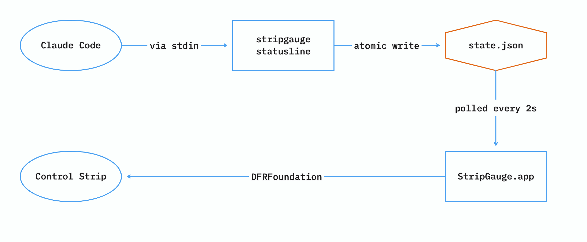

# StripGauge

Claude Code subscription quota on the MacBook Pro Touch Bar.


Two rows in the Control Strip: percentage of the 5-hour window used, and percentage of the
7-day window. Each row is coloured on its own reading — green, yellow from 60%, red from 85%, and
grey while there is no reading yet — so a quiet five-hour window does not look alarming just
because the weekly one is filling up. It appears while Claude Code is running and disappears about
half a minute after the last session closes.

Tap it for the detail, and tap again — or use the close box — to go back:


Each window gets a bar, a countdown, and the time it comes back. The Control Strip stays put
underneath, so brightness and volume remain reachable while this is open.

## How it works

Claude Code's `statusLine` hook hands a JSON payload to any command you configure, and that
payload already contains `rate_limits.five_hour.used_percentage` and
`rate_limits.seven_day.used_percentage` — the same numbers `/usage` reports. So there is nothing
to scrape and no API to call.



```text
Claude Code --via stdin-> stripgauge statusline --atomic write-> ~/Library/Application Support/stripgauge/state.json --polled every 2s-> StripGauge.app --DFRFoundation via dlsym-> Control Strip
```

One binary, two modes. `stripgauge statusline` is what Claude Code invokes on every update; the
same binary, launched from the app bundle, draws the Control Strip item.

Every session writes to the same file, and they do not agree. Each reports the numbers from *its
own* last API response, so a session left open overnight keeps republishing a percentage for a
five-hour window that ended hours ago — every ten seconds, thanks to `refreshInterval`. Each
window therefore carries its `resets_at`, and a reading whose window has already ended is
discarded rather than displayed. Within one window the higher percentage wins, since usage only
accumulates until the reset, and a session that has not called the API yet contributes nothing
instead of blanking what another session published.

Dependencies: none. Foundation and AppKit only.

## Build

Requires a Touch Bar Mac and Xcode's Swift toolchain.

```sh
./build.sh
mv StripGauge.app /Applications/
open /Applications/StripGauge.app
```

`build.sh` runs `swift build -c release`, assembles `StripGauge.app` in the repository root by hand
— SwiftPM cannot emit app bundles, and the Touch Bar service ignores a bare binary — and ad-hoc
signs it. Move it out of the repository: a rebuild overwrites it in place, and the paths below have
to keep pointing at wherever it actually lives.

Then point Claude Code at the same binary, in `~/.claude/settings.json`:

```json
{
  "statusLine": {
    "type": "command",
    "command": "/Applications/StripGauge.app/Contents/MacOS/stripgauge statusline",
    "refreshInterval": 10
  }
}
```

`refreshInterval` matters. Status line updates are event-driven, so a session left idle stops
emitting them; the timer keeps the state file fresh so an open-but-quiet session does not look
like a closed one. Keep it below the 30-second staleness window.

The status line itself prints `5h 11% · 7d 79% · ctx 34%`, so the terminal shows the same numbers
as the Touch Bar plus context usage.

To start it at login, open System Settings → General → Login Items, add an item under "Open at
Login", and pick the app you just moved. It has no Dock icon and no window, so nothing will appear
when it launches — the gauge showing up in the Control Strip is the only sign it is running.

```sh
swift test    # covers parsing, merging, formatting, thresholds, staleness
```

The Touch Bar layer has no automated coverage — it is isolated in `ControlStrip.swift` so that
everything else stays testable without a Touch Bar.

## Caveats

**It uses private API.** Putting anything in the Control Strip requires
`DFRElementSetControlStripPresenceForIdentifier` from `DFRFoundation` and `NSTouchBarItem`'s
`addSystemTrayItem:`, neither of which Apple documents. StripGauge reaches them through `dlsym`
and a selector, so a macOS update that moves them makes the app exit with a message instead of
crashing — but it would still stop working. This also means it can never ship on the App Store.

**The slot is small.** The Control Strip grants roughly 55 × 30 pt, measured. That is two rows of
about six characters, which is why the layout is `5h 11%` over `7d 79%` and not one longer line.
Asking for a wider view does not help: an explicit width constraint gets discarded, and content
wide enough to need more space is handed a slot the Control Strip then declines to draw.

**Rate limits are not always present.** They appear only for Claude.ai subscribers, and only
after a session's first API response. Until then each row shows `—`.

**The hardware is end-of-life.** The Touch Bar shipped on MacBook Pros from 2016 to 2020 and
Apple has not made one since.

## Licence

MIT
